# Tic Tac Toe

**Tic Tac Toe** is a terminal-based Python game where a player competes against a computer opponent by taking turns placing 'X' and 'O' on a 3x3 grid. The first to align three symbols horizontally, vertically, or diagonally wins.

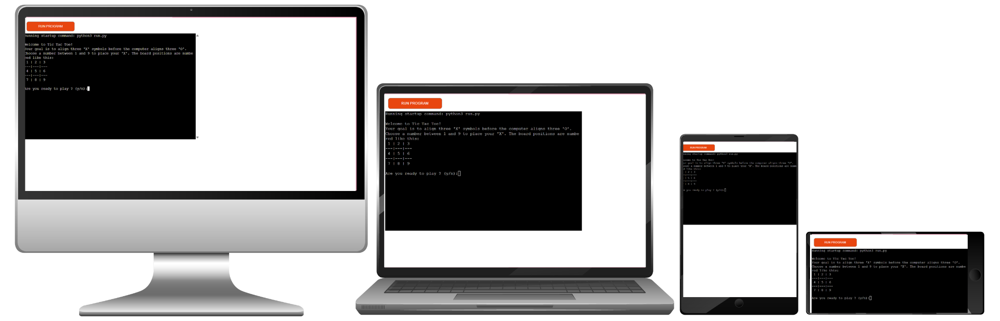

 [Here is the link to the live version of the project.](https://tic-tac-toe-the-game-31d8bb279e7c.herokuapp.com/)

## How to play

When you run the program, you’ll be greeted with a welcome message explaining the objective and layout of the Tic Tac Toe board. Your goal is to place three of your symbols (‘X’) in a row — horizontally, vertically, or diagonally — before the computer places three of its symbols (‘O’).

1. Start the Game: You’ll be asked if you're ready to play. Enter y or yes to begin, or n or no to exit.

2. The computer makes a move: The computer will automatically select an available position to place its ‘O’.

3. Making a Move: On your turn, enter a number between 1 and 9 to place your ‘X’ on the board. The numbers correspond to board positions shown during the initial instructions.

4. Board Updates: After each move (yours and the computer’s), the current state of the board will be displayed.

5. Win or Draw Check: After every turn, the game checks if either player has aligned three of their symbols. If so, the winner is announced. If the board is full with no winner, it's a draw.

6. Play Again: After the game ends, you’ll be asked if you want to play again. Enter y or yes to play another round. If you enter n or no, the game will exit.

## Project Purpose
This project was developed to provide a simple, accessible, and engaging version of the classic game Tic Tac Toe that can be played directly in the terminal. The aim is to offer users a quick and interactive gaming experience without the need for complex installations or graphical interfaces.

Tic Tac Toe was chosen because it's easy to understand, appeals to all ages, and presents a balanced challenge between player and computer. The game encourages strategic thinking, while its minimalist, text-based design ensures it's compatible with most environments, making it ideal for casual players, students, or anyone looking for a short mental break.

By incorporating features like a computer opponent, input validation, and the ability to replay games, the project prioritizes user interaction and replayability. Planned enhancements such as smarter AI and player customization aim to further improve the experience and keep it dynamic.

## Features

### Existing features

- 3x3 Board Display:  
A visual representation of the Tic Tac Toe board is displayed in the terminal, updating after each move.

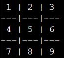

- Computer Opponent:  
The game uses Python’s built-in random library to simulate a simple AI opponent. The computer selects random valid positions on the board, which ensures unpredictability and provides basic but effective single-player gameplay. The random module was chosen for its simplicity and availability without requiring any third-party dependencies.

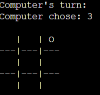

- User Input Handling:  
The player is prompted to input a number between 1 and 9 to select a position on the board.

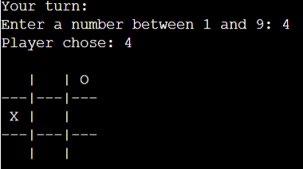

- Input Validation and Error Handling:  
The game checks that the user input is:  
   - A number

   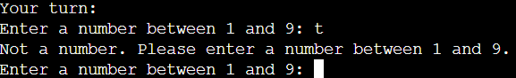
   - Within the valid range (1–9)
   
   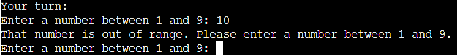
   - On an empty spot  
   
   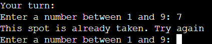

   If the input is invalid, a helpful message is displayed, and the user is asked to try again.

### Future Features
 
- Smarter Computer Logic (AI Upgrade)
Replace the random move selection with a more strategic algorithm to make the computer a more challenging opponent that can block the player and plan winning moves.
- Player Symbol Selection
Allow the player to choose whether they want to play as ‘X’ or ‘O’ at the start of the game, instead of always defaulting to ‘X’.
- Alternate Starting Player
Introduce an option to decide who goes first (the player or the computer) or automatically alternate the starting player in each round for a fairer gameplay experience.

## Data Model

The application uses a simple object-oriented data model centered around a Board class. This class manages the state and display of the 3x3 Tic Tac Toe grid:

- self.grid: A one-dimensional Python list of 9 elements representing the board cells. Each index (0–8) corresponds to a specific position on the board, allowing for straightforward data manipulation and win/draw checks. Although the player inputs numbers between 1 and 9 for ease of use, the code automatically converts these inputs to a 0–8 range internally to align with Python’s zero-based indexing.

- display_board(): A method that prints the current state of the board in a visually understandable 3x3 format, helping players see the game progression.

By encapsulating board-related data and logic inside a class, the program maintains cleaner separation of concerns and supports easier updates or extensions in the future.

## Testing

I have manually tested this project by doing the following: 

- Passed the code through a PEP8 linter and confirmed there are no problems.
[PEP8 link](https://pep8ci.herokuapp.com/)
- Given invalid inputs: 
   - Strings when numbers are expected
   - Out of range (1-9) numbers
   - Non-empty spots
   - Pressing Enter without typing a value
- Tested in my local terminal and the Code Institute Heroku terminal.
- Played through the game multiple times to confirm the core functionality works:
    - Verified that the player can win

    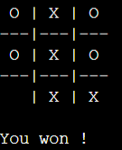
    - Verified that the computer can win

    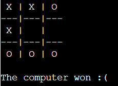
    - Verified that a draw is correctly detected when the board is full and there is no winner

    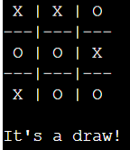

### Bugs

The following bugs were discovered during the development process. Solutions and explanations can be found in the Development section:
- Board Reset Bug: The board would reset after each move due to incorrect method structuring inside the Board class.
- No Output Displayed: Initially, no output appeared in the terminal because an instance of the Board class was not created in main().
- Invalid Reference to self: Tried to update the board from outside the class using self.grid, which caused errors. This was fixed by referencing board.grid instead.
- Repetitive Win Check Logic: Early win detection was hard-coded and repetitive. It was replaced with a loop through a list of winning combinations.
- Unnecessary Loop in check_win(): The function originally contained a redundant while True loop, which was removed for efficiency.
- Play Again Loop Bug: Calling main() from inside play_again() caused the game to loop indefinitely, even when the player chose to exit. This was resolved by using a loop inside main() and returning a boolean from play_again() to control flow cleanly.

### Remaining Bugs

There are currently no known remaining bugs. All identified issues during development were resolved, as detailed in the Development section.

### Validator Testing

- PEP8
   - No errors were returned from PEP8.
   [PEP8 link](https://pep8ci.herokuapp.com/)
   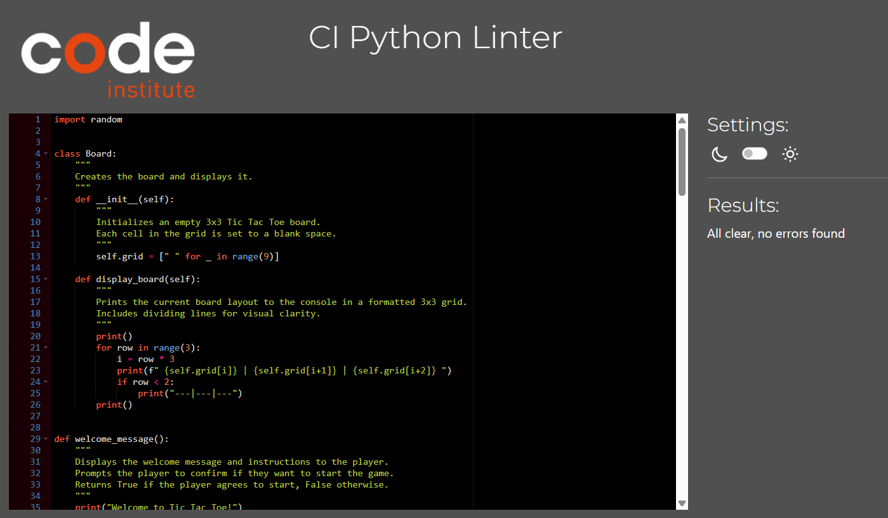

## Flowchart

The following flowchart outlines the game's core logic, including the turn structure and win/draw checks:
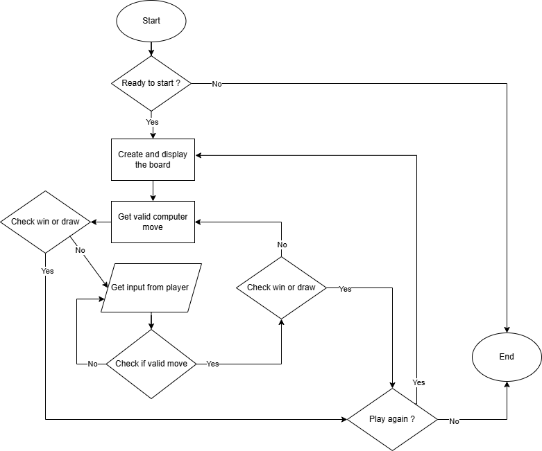

## Development

- I started by planning the flow of my code on paper. I outlined which functions I would need and in what order they should run. This helped me ensure the code would be structured and logical before writing it. Planning ahead also helped me avoid bugs and made the code easier to reuse and maintain.
- I decided to create a Board class to manage the game board. It includes an __init__ method to initialize the board and a display_board method to print it. After some trial and error, I realized I needed to structure the methods carefully so the board wouldn't reset after each move. I added formatting with side and bottom separators to improve readability, and I used a condition to avoid adding a line under the last row to keep the layout symmetrical.
[Link to the commit: Create Board class with __init__ and display_board methods and  main function](https://github.com/saraelizalde/tic-tac-toe/commit/bacdfdf1e9f2216eb5eba7973cfdb7e244c98563)
- I created the main function to call and run all the other functions. Initially, no output appeared because I had not created an instance of the Board class. Once I added it, the board displayed as expected.
- Next, I created the get_player_input function, which includes error handling and checks to ensure the input is a number between 0 and 8. Initially, I tried to update the board inside this function using self.grid[move] = 'X', but that didn’t work because I was referencing self without being inside the class. I realized I needed to use board.grid[move] = 'X' instead. I also moved this line into the main function so that it could properly access the player's input and update the board.
[Link to the commit: Create get_player_input function with input validation and error handling](https://github.com/saraelizalde/tic-tac-toe/commit/760e0d57bb0cf3ca648671bed644b2c1e6dce0cf)
[Link to the commit: Update board with 'X' at player's chosen position](https://github.com/saraelizalde/tic-tac-toe/commit/b33369cd2781b0f4ccf55d92ae61faff7616926f)
- For the get_computer_input function, I imported the random module from Python’s standard library. I used random.randint(0, 8) to generate a random number between 0 and 8, simulating the computer's move. The function loops until it finds an empty spot on the board to ensure the computer doesn’t pick an already occupied cell.
[Link to the commit: Create get_computer_input function using random library](https://github.com/saraelizalde/tic-tac-toe/commit/a6a0caf870c8a6c44d14422f49c9ca540bf6596f)
- For the check_win function, I initially wrote a basic condition to detect a win, like checking if the first row was all Xs. But that led to repetitive code. To simplify it, I created a list of all winning combinations and looped through them. I struggled at first to match these combinations with the correct board positions. Eventually, I removed the unnecessary while True loop and used return True when a winning condition was met, and return False if none were.
[Link to the commit: Create check_win function with win_combinations list to determine game winner](https://github.com/saraelizalde/tic-tac-toe/commit/97ac0ba969c481051a191723ca1a54ea39e71ef1)
- I then wrote the play_game function to handle turn-taking between the player and the computer. It runs in a loop until someone wins or the game ends in a draw. To keep the game flow organized, I moved some function calls—like getting player input, updating the board, and checking for a win from main into play_game. This made the main function cleaner and kept the game logic all in one place.
[Link to the commit: Create play_game function to alternate player turns and simplify main function](https://github.com/saraelizalde/tic-tac-toe/commit/80f666c67f54e8e5b6495e56e274b2719dd8aacb)
- I then wrote the check_draw function to detect when the game ends in a draw (when all spaces on the board are filled and no one has won). After creating it, I added a call to check_draw inside the play_game function, right after checking for a win, so the game can correctly end and inform the player when there's no winner.
[Link to the commit: Add check_draw function and simplify play_game loop logic](https://github.com/saraelizalde/tic-tac-toe/commit/5ac77565f714d2039a3463f1df1e4bffe4ab5ff5)
- While writing the play_again function, I ran into a problem where the game kept asking if I wanted to play again, even when I said no. This happened because I was calling main() from inside play_again(), which created a new loop every time and never exited properly. I tried calling play_game() instead, and while it exited correctly on "no," it didn’t restart the game properly since the board wasn’t reset. I considered resetting the board inside play_again(), but decided a better solution was to structure a loop inside main() and use play_again() only to return True to restart or False to exit. This way, the game could restart cleanly without nested function calls.
[Link to the commit: Create play_again function and refactor main to support replay loop](https://github.com/saraelizalde/tic-tac-toe/commit/91e061c8dc9e7971b9fa0eda8cd444a2f26710d8)
- To increase the game’s difficulty and make it less predictable, I made the computer play first by adjusting the order of turns in the play_game function.
[Link to the commit: Refactor play_game so the computer moves first, increasing difficulty](https://github.com/saraelizalde/tic-tac-toe/commit/4a8fcf852f893366faa35d2b950c05a94ccb2b16)
- I removed the initial display of an empty board at the beginning of each game, as it added unnecessary visual clutter before the first move.
[Link to the commit: Remove initial display of empty board before game starts in main function](https://github.com/saraelizalde/tic-tac-toe/commit/ebc82eb6ca29a76875ecb9e3cc22df0c8bc8e271)
- I moved the welcome message outside of the main game loop in the main() function. This prevented it from repeating every time a new game started, improving the user experience.
[Link to the commit: Prevent welcome message from printing on every replay](https://github.com/saraelizalde/tic-tac-toe/commit/59d787e56f7cba6c9fef6da1a444e401e4e74774)
- While checking my code with the PEP8 linter, I ran into issues in the check_win function because some if statements were too long. I couldn't split the lines with backslashes (as it's not recommended and caused warnings), so I used parentheses to cleanly break the conditions across multiple lines without causing syntax errors. This made the code both compliant with PEP8 and easier to read.
[Link to the commit: Fix PEP8 issues and update README content](https://github.com/saraelizalde/tic-tac-toe/commit/b24b283f9247e3911d9d41690c1cd745a49c08a0)
- To make the game more user-friendly, I changed the input system so players enter numbers 1 to 9 instead of 0 to 8. At first, I tried adjusting the board display, but it caused indexing issues. I fixed it by subtracting 1 from the player's input, keeping the internal logic zero-based while showing 1–9 to the player. 
[Link to the commit: Update input system to use 1-9 instead of 0-8 for better user experience](https://github.com/saraelizalde/tic-tac-toe/commit/a3d795d7973f61fbfed4bc9df341a72ef7650098)

## Deployment

This project was deployed using Code Institute's mock terminal for Heroku

- Step for deployment:
   - Fork or clone this repository from Github: [https://github.com/saraelizalde/tic-tac-toe](https://github.com/saraelizalde/tic-tac-toe)
   - Create a new Heroku app: [Heroku link](https://www.heroku.com/)
   - In the settings:
       - Set the buildpacks in this order: Python first, then NodeJS.
       - Set Config Vars to: key: PORT and value: 8000
   - Link the Heroku app to the repository
   - Click on Deploy

- Here is the link to the deployed website: [https://tic-tac-toe-the-game-31d8bb279e7c.herokuapp.com/](https://tic-tac-toe-the-game-31d8bb279e7c.herokuapp.com/) 
- Here is the link to the github repository: [https://github.com/saraelizalde/tic-tac-toe](https://github.com/saraelizalde/tic-tac-toe)

## Screenshots of Project Outcomes

- ### Game Start
Shows the welcome message and initial prompt asking if the player wants to begin.

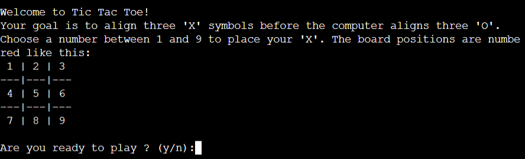
- ### Computer’s Turn 
The computer will begin the game by placing an ‘O’ in a random available spot.

- ### Your Turn
After the computer moves, you’ll be prompted to choose a number between 1 and 9 to place your ‘X’.

- ### Win Detected
The game detects a winning combination and announces the player or the computer as the winner.

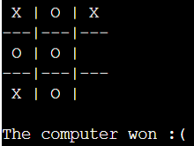
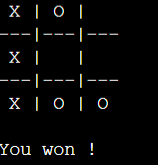
- ### Draw Detected
If the board fills up without a winner, the game correctly ends in a draw.

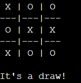
- ### Play Again Prompt
At the end of a game, the player is prompted to start a new game or exit.

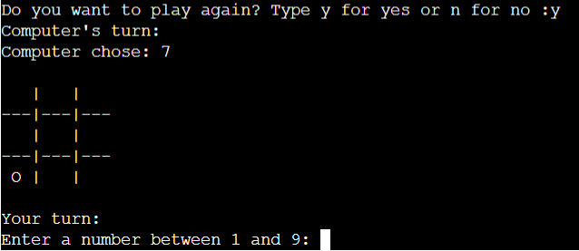
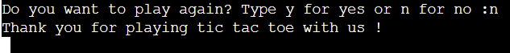

## External Libraries Used
- random – Python Standard Library module used to generate the computer's moves.
The random module from Python’s standard library is used to simulate the computer's moves. It selects a valid empty cell at random, giving the computer unpredictable behavior, which makes the game more dynamic and engaging.

## Credits

- Flowchart created with [draw.io](https://app.diagrams.net/).
- ChatGPT helped me with the phrasing and structure of this README.
- Can Sücüllü my Code Institute mentor reviewed my code and providing valuable feedback.
